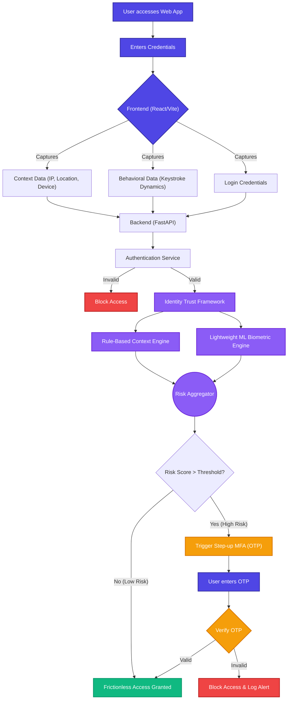

```mermaid
graph TD
    A["User accesses Web App"] --> B["Enters Credentials"]
    B --> C{"Frontend (React/Vite)"}
    
    C -->|"Captures"| D["Context Data (IP, Location, Device)"]
    C -->|"Captures"| E["Behavioral Data (Keystroke Dynamics)"]
    C -->|"Captures"| F["Login Credentials"]
    
    D --> G["Backend (FastAPI)"]
    E --> G
    F --> G
    
    G --> H["Authentication Service"]
    H -->|"Invalid"| Z["Block Access"]
    H -->|"Valid"| I["Identity Trust Framework"]
    
    I --> J["Rule-Based Context Engine"]
    I --> K["Lightweight ML Biometric Engine"]
    
    J --> L(("Risk Aggregator"))
    K --> L
    
    L --> M{"Risk Score > Threshold?"}
    
    M -->|"No (Low Risk)"| N["Frictionless Access Granted"]
    M -->|"Yes (High Risk)"| O["Trigger Step-up MFA (OTP)"]
    
    O --> P["User enters OTP"]
    P --> Q{"Verify OTP"}
    
    Q -->|"Valid"| N
    Q -->|"Invalid"| R["Block Access & Log Alert"]
    
    classDef primary fill:#4f46e5,stroke:#3730a3,stroke-width:2px,color:#fff;
    classDef secondary fill:#10b981,stroke:#059669,stroke-width:2px,color:#fff;
    classDef warning fill:#f59e0b,stroke:#d97706,stroke-width:2px,color:#fff;
    classDef danger fill:#ef4444,stroke:#b91c1c,stroke-width:2px,color:#fff;
    classDef core fill:#8b5cf6,stroke:#6d28d9,stroke-width:2px,color:#fff;
    
    class A,B,C,P primary;
    class N secondary;
    class O,Q warning;
    class Z,R danger;
    class I,J,K,L core;
```